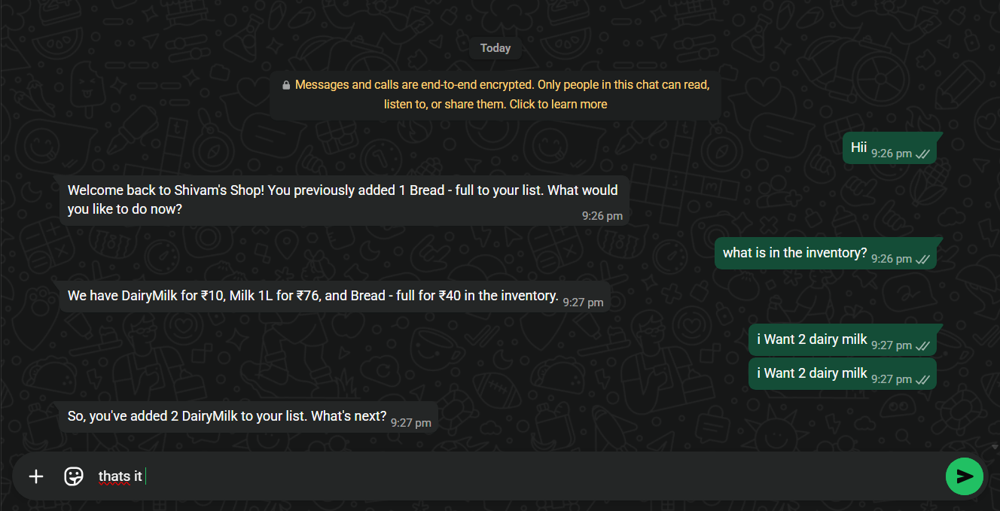
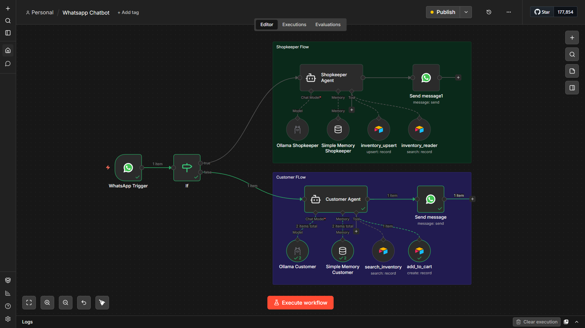
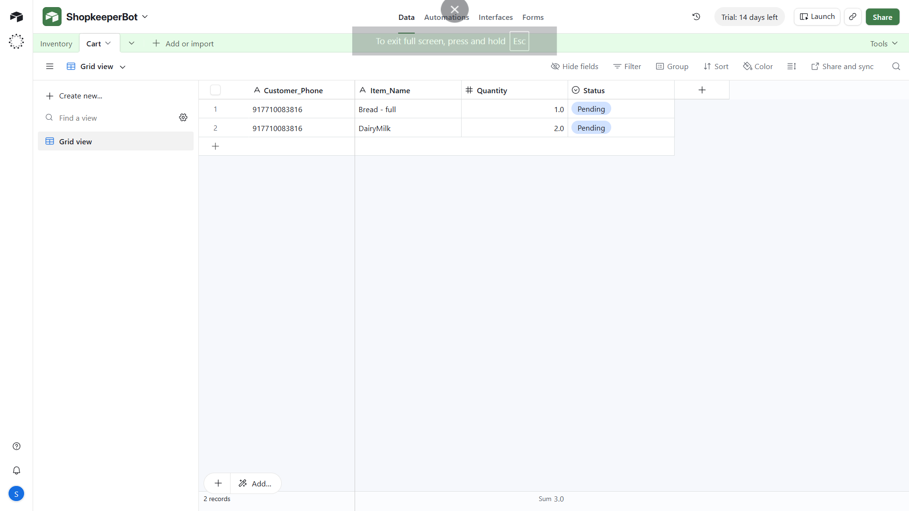

# 🛒 ShopSync
### *An Agentic AI Assistant for Local Businesses*

A self-hosted, 24/7 WhatsApp automation that uses local AI to manage inventory and assist customers. This project bridges the gap between a physical shop and a digital assistant without the monthly subscription costs of SaaS platforms.

---

## 💡 Why This?

Managing a small business inventory while responding to customer queries on WhatsApp is a manual bottleneck. This project creates an "Agentic" flow where the AI doesn't just talk—it **acts** by reading and writing to your database.

| **Customer View** |
| :---: | :---: |
|  
| *AI answering queries from the database* |

| **The "Brain" (n8n Workflow)** | **The Database (Airtable)** |
| :---: | :---: |
|  |  |
| *Visual logic of the AI Agent* | *Real-time inventory sync* |

---

## 🏗️ Architecture

The system follows a webhook-driven loop to ensure high-speed responses and data integrity:

1. **Trigger:** `WhatsApp Cloud API` sends a webhook to `n8n`.
2. **Logic:** A `Switch Node` determines if the user is a Customer or an Admin (via passcode).
3. **Brain:** `Ollama` (Local LLM) processes the request using `Window Buffer Memory` for context.
4. **Action:** The AI uses the `Airtable Tool` to fetch or update records.
5. **Response:** `n8n` sends a formatted WhatsApp message back to the user.

---

## ✨ Features
- **Zero API Costs:** Uses **Ollama** for local inference.
- **Role-Based Access:** Toggle between Customer and Admin modes using a secret key.
- **Persistent Memory:** Remembers previous messages in the conversation.
- **Natural Language DB Updates:** "Add 5 units of milk" automatically updates the Airtable cell.

---

## 🚀 How to Use

### 1. Import the Workflow
* Open your n8n instance.
* Click **Menu** > **Import from File**.
* Upload the `Whatsapp_Chatbot.json` file.

### 2. Set Up Credentials

#### 2.a. WhatsApp Developer Side (Meta)
1. Create a **System User** in your Meta Business Suite to get a **Permanent Access Token**.
2. Whitelist your phone number in the **API Setup** section.
3. In n8n, enter your `Access Token`, `Phone Number ID`, and `WhatsApp Business Account ID` into the WhatsApp node credentials.

#### 2.b. Airtable Integration
1. Create an Airtable Base with columns: `Item Name`, `Price`, and `Quantity`.
2. Generate a **Personal Access Token** with `data.records:read` and `data.records:write` scopes.
3. Link the Base ID and Table Name in the n8n Airtable tool nodes.

---

## ▶️ How to Run

1. **Start Ollama:** Open a terminal and run your local model (e.g., `ollama run llama3`).
2. **Start Ngrok:** Open a separate terminal and start ngrok to expose your local n8n instance to the internet (e.g., `ngrok http 5678`). *(Note: If you are using n8n's built-in tunnel instead, you can skip this step).*
3. **Activate the Workflow:** In your n8n dashboard, ensure your WhatsApp webhook is correctly pointed to your Ngrok/Tunnel URL, and flip the toggle in the top right corner to **Active**.
4. **Start Messaging:** Open WhatsApp on your phone and send a message to your bot's number!

---

## 🛠️ Troubleshooting

### 1. Docker & Tunneling (The Webhook Fix)
If you are hosting n8n via Docker, standard local URLs won't work for Meta's webhooks.
* **The Ngrok Problem:** Free Ngrok accounts show a "Visit Site" warning page that blocks Meta's verification bot.
* **The Solution:** Use n8n's built-in tunnel. Restart your Docker container with this command:
  ```bash
  docker run -it --rm --name n8n -p 5678:5678 -v ~/.n8n:/home/node/.n8n docker.n8n.io/n8nio/n8n start --tunnel
